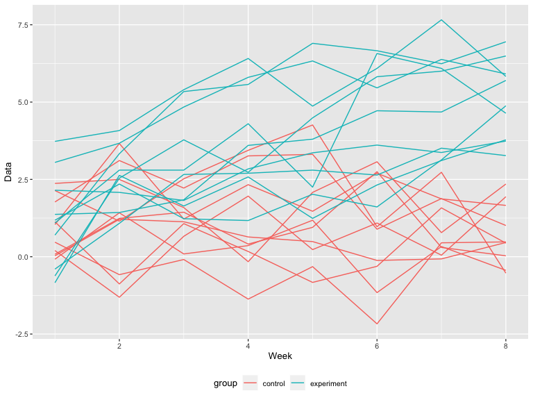

P8105 Homework 5
================
Junxian Chen (jc5314)
11/2/2019

# Problem 1

``` r
set.seed(10)

iris_with_missing = iris %>% 
  map_df(~replace(.x, sample(1:150, 20), NA)) %>%
  mutate(Species = as.character(Species))
```

``` r
replaceNA = function(x){
  if (class(x) == "numeric") {
    replace_na(x, mean(x, na.rm = TRUE))
  } else if (class(x) == "character") {
    replace_na(x, "virginica")
  }
}

output = map_df(iris_with_missing, replaceNA)
```

# Problem 2

``` r
p2_df =
  tibble(
    file_name = list.files(path = './data', full.names = TRUE),
    data = map(file_name, ~read_csv(.)),
    group = case_when(
      file_name %>% str_detect("con") ~ "control",
      file_name %>% str_detect("exp") ~ "experiment",
    ),
    id = as.numeric(str_extract_all(file_name, "[0-9]+"))
  ) %>% 
  unnest(cols = c(data)) %>% 
  pivot_longer(
    week_1:week_8,
    names_to = "week",
    values_to = "data"
  ) %>% 
  mutate(
    subject_id = paste(group, "_", as.character(id), sep = ""),
    week = as.numeric(str_extract_all(week, "[0-9]+"))
  ) %>% 
  select(subject_id, group, id, week, data)
```

A spaghetti plot showing observations on each subject over time:

``` r
p2_df %>% 
  ggplot(aes(x = week, y = data, group = subject_id, color = group)) +
  geom_line() +
  xlab("Week") +
  ylab("Data")
```



*Comments:*
