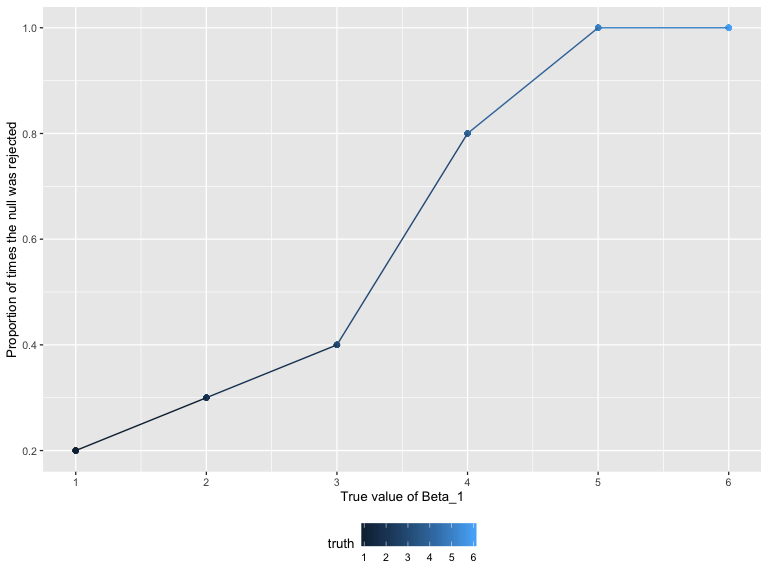
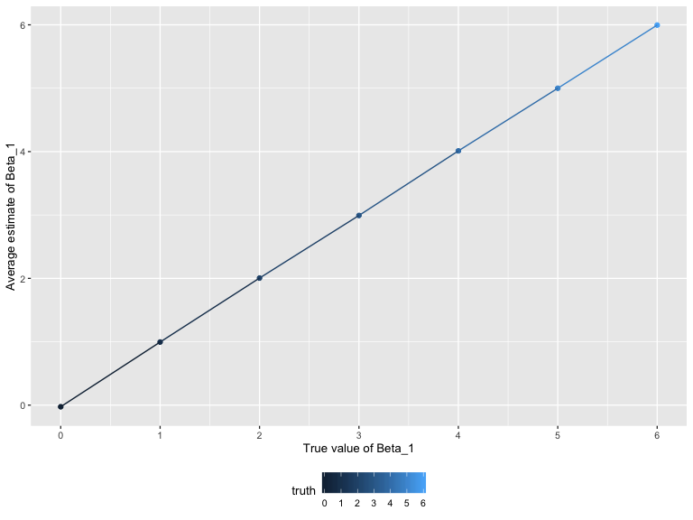

P8105 Homework 5
================
Junxian Chen (jc5314)
11/2/2019

# Problem 1

``` r
set.seed(10)

iris_with_missing = iris %>% 
  map_df(~replace(.x, sample(1:150, 20), NA)) %>%
  mutate(Species = as.character(Species))
```

Firstly, load the dataset with missing values.

``` r
replaceNA = function(x){
  
  if (class(x) == "numeric") {
    replace_na(x, mean(x, na.rm = TRUE))
  } else if (class(x) == "character") {
    replace_na(x, "virginica") 
  } else {
    stop("Input is neither numeric nor character")
  }

}
```

Next, a function called `replaceNA` is created. This function will take
a vector as an argument, detect the input variable type and then replace
missing values using the rules defined in the question. If the input
value is neither numeric nor character, the function will stop and give
out error information.

Lastly, apply this function to the columns of dataset using a map
statement.

``` r
output = map_df(iris_with_missing, replaceNA)

output
```

    ## # A tibble: 150 x 5
    ##    Sepal.Length Sepal.Width Petal.Length Petal.Width Species
    ##           <dbl>       <dbl>        <dbl>       <dbl> <chr>  
    ##  1         5.1          3.5         1.4         0.2  setosa 
    ##  2         4.9          3           1.4         0.2  setosa 
    ##  3         4.7          3.2         1.3         0.2  setosa 
    ##  4         4.6          3.1         1.5         1.19 setosa 
    ##  5         5            3.6         1.4         0.2  setosa 
    ##  6         5.4          3.9         1.7         0.4  setosa 
    ##  7         5.82         3.4         1.4         0.3  setosa 
    ##  8         5            3.4         1.5         0.2  setosa 
    ##  9         4.4          2.9         1.4         0.2  setosa 
    ## 10         4.9          3.1         3.77        0.1  setosa 
    ## # … with 140 more rows

# Problem 2

Read in and tidy the datasets:

``` r
p2_df =
  tibble(
    file_name = list.files(path = './data', full.names = TRUE),
    data = map(file_name, ~read_csv(.)),
    group = case_when(
      file_name %>% str_detect("con") ~ "control",
      file_name %>% str_detect("exp") ~ "experiment",
    ),
    id = as.numeric(str_extract_all(file_name, "[0-9]+"))
  ) %>% 
  unnest(cols = c(data)) %>% 
  pivot_longer(
    week_1:week_8,
    names_to = "week",
    values_to = "data"
  ) %>% 
  mutate(
    full_id = paste(group, "_", as.character(id), sep = ""),
    week = as.numeric(str_extract_all(week, "[0-9]+"))
  ) %>% 
  select(full_id, group, id, week, data)

p2_df
```

    ## # A tibble: 160 x 5
    ##    full_id   group      id  week  data
    ##    <chr>     <chr>   <dbl> <dbl> <dbl>
    ##  1 control_1 control     1     1  0.2 
    ##  2 control_1 control     1     2 -1.31
    ##  3 control_1 control     1     3  0.66
    ##  4 control_1 control     1     4  1.96
    ##  5 control_1 control     1     5  0.23
    ##  6 control_1 control     1     6  1.09
    ##  7 control_1 control     1     7  0.05
    ##  8 control_1 control     1     8  1.94
    ##  9 control_2 control     2     1  1.13
    ## 10 control_2 control     2     2 -0.88
    ## # … with 150 more rows

A spaghetti plot showing observations on each subject over time:

``` r
p2_df %>% 
  ggplot(aes(x = week, y = data, group = full_id, color = group)) +
  geom_line() +
  xlab("Week") +
  ylab("Data")
```


*Comments:* The data values of the experiment group were increasing
along with time and the overall data values in experiment group were
distinctly larger than the control group after 6 weeks.

# Problem 3

``` r
generate_xy = function(beta_1, n, beta_0, sigma){
  
  tibble(
    x = rnorm(n),
    y = beta_0 + beta_1 * x + rnorm(n, 0, sigma)
  )
  
}
```

Firstly, a function called `generate_xy` is created. This function will
generate *n* pairs of (*x*, *y*), where *x*’s are random numbers
following Normal distribution and *y*’s come from the given model in the
question.

``` r
generate_df = function(beta_1, generate_xy, n = 30, beta_0 = 2, sigma = sqrt(50)){
  
  tibble(
    truth = beta_1,
    data = rerun(10, generate_xy(beta_1, n, beta_0, sigma)),
    model = map(data, ~ broom::tidy(lm(y ~ x, data = .))),
    estimate = map(model, ~ .x[2,2]),
    p_value = map(model, ~ .x[2,5])
  )  %>% 
  unnest(estimate:p_value) %>% 
  select(-model, p_value = p.value)
  
}
```

Next, another function called `generate_df` is created. This function
will generate 10000 datasets which contain 30 pairs of (*x*, *y*) in
each. Then the generated *x* and *y* will be fitted to linear regression
model and estimators of

as well as p-values will be obtained. The estimators and p-values will
be extracted and included in the dataset.

1)  When  = 0:

<!-- end list -->

``` r
set.seed(1)

df_1 = generate_df(beta_1 = 0, generate_xy)

df_1
```

    ## # A tibble: 10 x 4
    ##    truth data              estimate p_value
    ##    <dbl> <list>               <dbl>   <dbl>
    ##  1     0 <tibble [30 × 2]>  0.296     0.798
    ##  2     0 <tibble [30 × 2]>  0.00648   0.996
    ##  3     0 <tibble [30 × 2]> -2.16      0.155
    ##  4     0 <tibble [30 × 2]> -0.454     0.718
    ##  5     0 <tibble [30 × 2]> -0.514     0.730
    ##  6     0 <tibble [30 × 2]>  1.71      0.243
    ##  7     0 <tibble [30 × 2]> -1.18      0.322
    ##  8     0 <tibble [30 × 2]>  1.09      0.366
    ##  9     0 <tibble [30 × 2]>  0.806     0.377
    ## 10     0 <tibble [30 × 2]>  2.35      0.131

2)  When  = {1, 2, 3, 4, 5, 6}:

<!-- end list -->

``` r
beta_1 = list(1, 2, 3, 4, 5, 6)

df_2 = 
  map(beta_1, ~ generate_df(.x, generate_xy)) %>% 
  bind_rows()

df_2
```

    ## # A tibble: 60 x 4
    ##    truth data              estimate p_value
    ##    <dbl> <list>               <dbl>   <dbl>
    ##  1     1 <tibble [30 × 2]>   2.72    0.0317
    ##  2     1 <tibble [30 × 2]>   3.67    0.0209
    ##  3     1 <tibble [30 × 2]>   2.54    0.0625
    ##  4     1 <tibble [30 × 2]>   0.0787  0.960 
    ##  5     1 <tibble [30 × 2]>   0.150   0.886 
    ##  6     1 <tibble [30 × 2]>   0.0752  0.959 
    ##  7     1 <tibble [30 × 2]>   1.07    0.338 
    ##  8     1 <tibble [30 × 2]>  -0.940   0.630 
    ##  9     1 <tibble [30 × 2]>   1.51    0.310 
    ## 10     1 <tibble [30 × 2]>   1.77    0.241 
    ## # … with 50 more rows

  - A plot showing the proportion of times the null was rejected (the
    power of the test) on the *y* axis and the true value of
     on the *x* axis.

<!-- end list -->

``` r
df_2 %>% 
  group_by(truth) %>% 
  mutate(
    reject_prop = sum(p_value < 0.05) / length(p_value)
  ) %>% 
  ggplot(aes(x = truth, y = reject_prop, color = truth)) +
  geom_point() + 
  geom_line() +
  xlab("True value of Beta_1") +
  ylab("Proportion of times the null was rejected") +
  scale_x_continuous(
    breaks = c(1, 2, 3, 4, 5, 6)
  )
```



*Comments:* Based on the plot, it can be seen that the power of the test
was increased when the effect size increased. More specifically, the
power was very small when the true value of

was less than 2, and the power was large and closed to 1 when the true
value of  was greater than 5.

  - A plot showing the average estimate of
     on the *y* axis and the true value of
     on the *x* axis:

<!-- end list -->

``` r
df_2 %>% 
  group_by(truth) %>% 
  summarize(mean_estimator = mean(estimate)) %>% 
  ggplot(aes(x = truth, y = mean_estimator, fill = truth)) +
  geom_col() +
  xlab("True value of Beta_1") +
  ylab("Average estimate of Beta_1") +
  scale_x_continuous(
    breaks = c(1, 2, 3, 4, 5, 6)
  )
```


  - A plot showing the average estimate of
     on the *y* axis and the true value of
     on the *x* axis only in samples for which the null was
    rejected:

<!-- end list -->

``` r
df_2 %>% 
  filter(p_value < 0.05) %>% 
  group_by(truth) %>% 
  summarize(mean_estimator = mean(estimate)) %>% 
  ggplot(aes(x = truth, y = mean_estimator, fill = truth)) +
  geom_col() +
  xlab("True value of Beta_1") +
  ylab("Average estimate of Beta_1") +
  scale_x_continuous(
    breaks = c(1, 2, 3, 4, 5, 6)
  )
```



*Comments:* Based on the plot,
